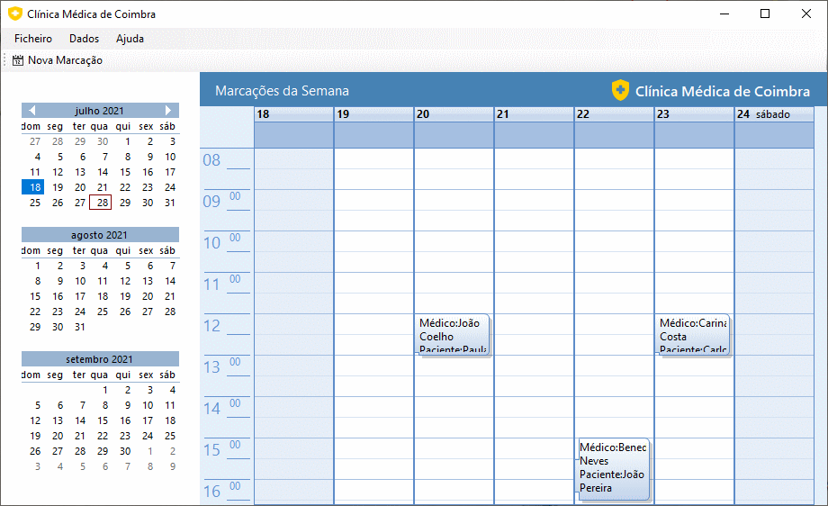
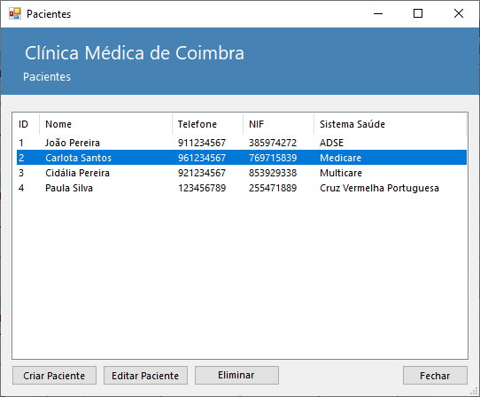
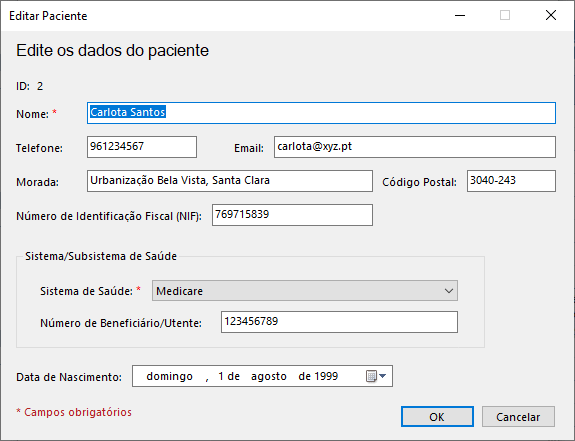
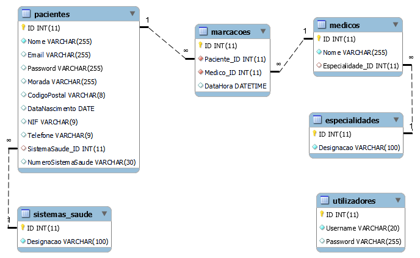
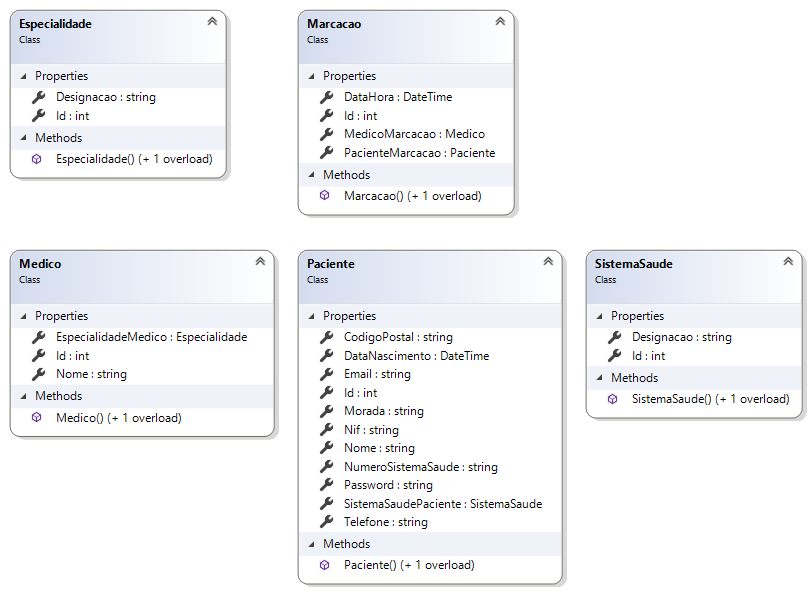
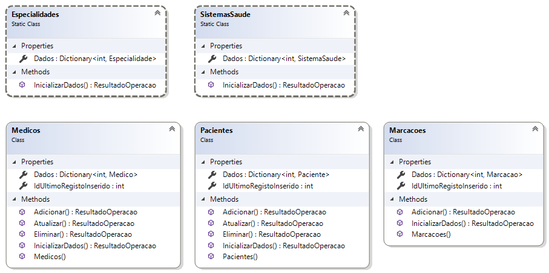
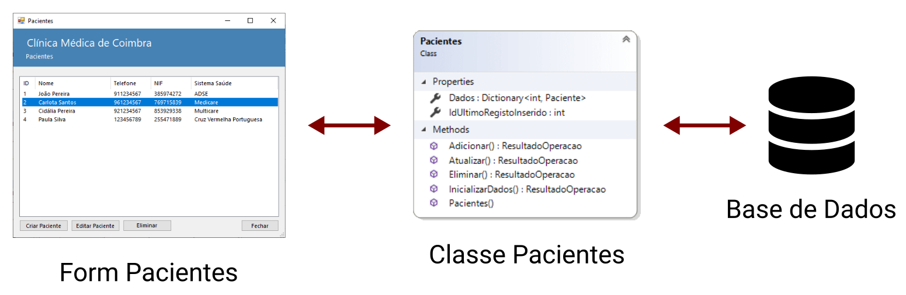
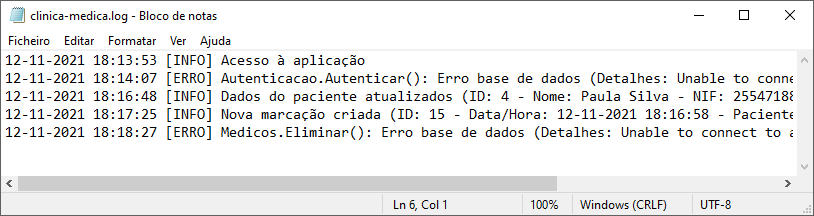
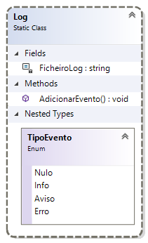

# Aplicação &quot;Clínica Médica de Coimbra&quot;

A aplicação **Clínica Médica de Coimbra** simula uma clínica médica fictícia, apresentando ao utilizador dados da mesma, podendo estes ser modificados: criar novos dados, editar dados, eliminar dados.

Esta aplicação foi desenvolvida com o intuito de demonstrar como efetuar a ligação de uma aplicação desktop, desenvolvida na linguagem C#, a uma base de dados MySQL/MariaDB.



## Requisitos

Para executar esta aplicação é necessário:
- um servidor de base de dados em execução (por exemplo: MariaDB ou MySQL em execução utilizando o software XAMPP)
- a base de dados ```clinica_medica_coimbra``` (ficheiro <a href="clinica-medica-coimbra.sql">clinica-medica-coimbra.sql</a>)
- o conector MySQL/NET connector
- .NET Framework 4.7.2

Para utilizar a aplicação deverá efetuar login com os seguintes dados:
- utilizador: **user1**
- password: **123**

## Descrição



A aplicação foi desenvolvida com o intuito de demonstrar os seguintes conceitos:
- obter dados de uma base de dados e apresentá-los ao utilizador 
- inserir novos dados na base de dados
- editar os dados na base de dados
- eliminar dados na base de dados



## Arquitetura da aplicação

Como já foi referido, a aplicação comunica com um servidor de base de dados.

A base de dados contém as seguintes tabelas:
- ```utilizadores```: dados de autenticação (username e password) que permitem aos utilizadores o acesso à aplicação
- ```especialidades```: especialidades médicas dos médicos da clínica
- ```sistemas_saude```: sistemas/subsistemas de saúde dos pacientes
- ```medicos```: os médicos da clínica
- ```pacientes```: os pacientes da clínica
- ```marcacoes```: marcações de consultas



### Classes

Para armazenar os dados na aplicação foram definidas as seguintes classes:

- ```Especialidade```
- ```Marcacao```
- ```Medico```
- ```Paciente```
- ```SistemaSaude```



Estas classes replicam a estrutura da base de dados e permitem armazenar os dados de um único registo: ou seja, uma instância de uma das classes corresponde a um registo de uma tabela.

Para armazenar os dados de todos os registos das tabelas utilizam-se as seguintes classes:

- ```Especialidades``` (classe estática)
- ```SistemasSaude``` (classe estática)
- ```Medicos```
- ```Pacientes```
- ```Marcacoes```



Repare que, em cada uma destas classes, os dados são colocados num dicionário, chamado ```Dados```. A chave de acesso a cada registo no dicionário corresponde à chave primária na tabela da base de dados.

Esta aplicação utiliza o *design pattern* **Active Record**: ou seja, as operações de bases de dados (ler, inserir, editar e eliminar) são implementadas diretamente nas classes que armazenam os dados.



As classes possuem os seguintes métodos os quais implementam as referidas operações:

- ```InicializarDados()```: obter os dados a partir da base de dados
- ```Adicionar()```: inserir um registo na base de dados
- ```Atualizar()```: editar um registo na base de dados
- ```Eliminar()```: eliminar um registo na base de dados

### Outras classes

As seguintes classes implementam funcionalidades adicionais:

- ```LigacaoDB```: contém os dados de ligação ao servidor de base de dados 
- ```Autenticação```: esta classe trata da autenticação de um utilizador na aplicação
- ```Log```: esta classe adiciona registos ao log da aplicação

Importa referir que a *connection string* para a base de dados, é armazenada na classe ```LigacaoDB``` por uma questão de conveniência e sem qualquer tipo de segurança.

**Numa aplicação real este tipo de dados deverão ser armazenados num local seguro e encriptado**.

### Log

O log (ou registo de eventos) é efetuado num ficheiro de texto e serve como suporte ao programador da aplicação permitindo obter informações detalhadas sobre as operações efetuadas e os erros ocorridos:



A classe estática ```Log``` é responsável por implementar as operações necessárias:



O nome e localização do ficheiro de texto são especificados na constante privada ```FicheiroLog```. Por defeito o ficheiro de log chama-se ```clinica-medica.log``` e é criado na pasta do executável.

O método ```AdicionarEvento()``` é utilizado para adicionar os eventos ao ficheiro.

### Inicialização

Durante o arranque da aplicação são efetuadas várias operações de inicialização, nomeadamente:

1.	Registar no log o início da aplicação
2.	Efetuar autenticação
3.	Obter dados das especialidades médicas
4.	Obter dados dados dos sistemas de saúde
5.	Obter dados dados dos médicos
6.	Obter dados dados dos pacientes
7.	Obter dados dados das marcações
8.	Mostrar a janela principal da aplicação
